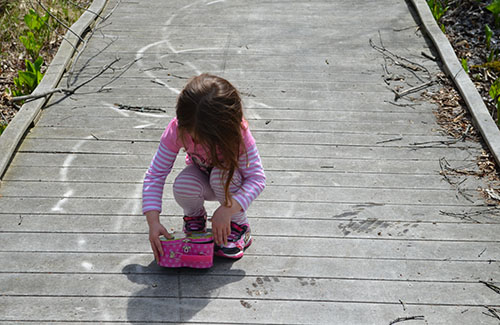
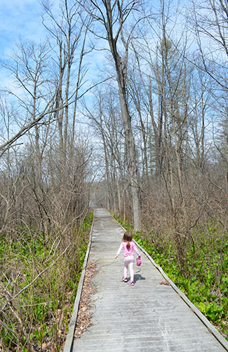

#DGMD-E-27-Spring2016-P4

This is the fourth assignment for DGMD E-27.

#Source Code

The code consists of the following files:

##Source HTML/php:
**index.php** - This is the landing page for the site. The header image is now contained in a div and uses interchange to swap for the various screen sizes. There is a main section that has some text describing the site and neighborhood as well as some responsive images that also use interchange. There is also a sidebar that incorporates a weather widget using the openweather API.

**photogallery.php** - This is a page for showing various neighborhood photo albums which could be accessed by clicking on the image. Only the pond image links to a gallery (thepondgallery.php. There is no weather sidebar on this page.

**thepondgallery.php** - This is a gallery page containing various photos of the neighborhood pond. This file incorporates the Orbit JavaScript based widget.

**thenaturepreserve.php** - This is another gallery page containing various photos of the nature preserve. This file incorporates the flexbox container/child code as well as some SVG/CSS animation.

**thingstodo.php** - This is a page for showing pictures of things to do in the city where my neighborhood resides. This page also shows the column swapping when going from desktop to mobile portrait mode as described in the week 3 videos. This page also uses more media queries around the end points for the typical media queries to maximize the image sizes for the appropriate screen widths.

**contact.php/login.php/register.php** - These are all form based php files with the weather widget side bar on the right side.

##SASS Source Files:
**app.scss** - This is the default foundation sass file that links in all the other partial sass files..<br>

##SASS Partial Files:
###Forms
**_formstyle.scss** - Stylings for the various forms in the site.<br>
**_form_variables.scss** - Sass variables used in formstyle partial.<br>
**_form_extends.scss** - Extends used in the formstyle partial.<br>
**_form_mixins.scss** - Mixins used in the formstyle partial.<br>
###Thingstodo
**_thingstodo.scss** - Stylings for the thingstodo page.<br>
**_thingstodo_variables.scss** - Sass variables used in the thingstodo partial.<br>
**_thingstodo_mixins.scss** - Mixins used in the thingstodo partial.<br>
###Weather
**_weather-style.scss** - Stylings for the weather sidebar.<br>
**_weather_variables.scss** - Variables used in the weather sidebar partial.<br>
**_weather_mixins.scss** - Mixins used in the weather sidebar partial.<br>
###Nature Preserve
**_naturepreserve.scss** - Stylings specific to the nature preserve gallery.<br>
###CSS4 Grid Specific
**_css4grid.scss** - Stylings specific to setting up the CSS4 grids.<br>
###General
**_helper_functions.scss** Some helper functions for other mixin files.<br>
**_styles.scss** - General stylings for site pages.<br>
**_variables.scss** - Variables for site pages.<br>
**_mixins.scss** - Mixins for the site pages.<br>
**_overrides.scss** - Foundation overrides in a specific file in order to find easier.<br>
**_settings.scss** - This is the default settings sass file that has some project specific modifications.<br>

## Generated CSS Files:
As everything is incorporated as partials, there is only one generated css file with regards to the work that I am doing.
**app.css** - This stylesheet contains all the styles from the foundation files as well as my own specific stylings.<br>

##JS Source Files (not including associated js needed for foundation):
**openWeather.js** - jQuery code snippet from Michael Lynch (http://michaelynch.com) distributed under MIT license to access the OpenWeather API.<br>

# Assignment Specific Topics
## Browser/Operating System
I primarily used a Google Chrome browser (Version 48.0.2564.116 m) running on a Windows 10 (64 bit) machine and Safari running on an Apple iPhone 6s plus (iOS 9.2.1).
## Site background
I am using the responsive website I built from Assignment 1, added SASS to in Assignment 2, and then added Foundation to in Assignment 3 as a starting point for this assignment.<br>
The URL for Assignment 1 is: http://dgmd-e27-p1.mikevartanian.me/index.php<br>
The URL for Assignment 2 is: http://dgmd-e27-p2.mikevartanian.me/index.php<br>
The URL for Assignment 3 is: http://dgmd-e27-p3.mikevartanian.me/index.php<br>
The comments and code for Assignment 1 are located in GitHub here: https://github.com/mvartani76/DGMD-E-27-Spring2016-P1<br>
The comments and code for Assignment 2 are located in GitHub here: https://github.com/mvartani76/DGMD-E-27-Spring2016-P2<br>
The comments and code for Assignment 3 are located in GitHub here: https://github.com/mvartani76/DGMD-E-27-Spring2016-P3<br>

## Flexbox
### Flexbox Froggy
I completed level 24 of the flexbox froggy game and the screenshot is attached.
### Flexbox Based Web Page

## CSS4 Grids
### Media Queries
Media queries are used with the CSS4 grids to primarily change the column widths to 100% in the mobile portrait screen width.<br><br>
The css4 grid for **photogallery.php** uses two media queries; one to set the column widths to 50% in mobile landscape screen width to have the number of photo columns change from four (4) to two (2) and the other to set the column width to 100% in mobile portrait screen width similar to the others.<br><br>
The css4 grid for **thingstodo.php** is a bit different in that the order of the grid changes in mobile portrait mode as shown starting on **line 164** of **_css4grid.scss** in the code snippet below.
```SCSS
 /* Note that in the mobile portrait screen sizes that the content section is shown
    before the sidebar (township information) */
.thingstodowrapper {
	grid-template-columns: 100%;
	grid-template-areas:
	"header"
	"menu"
	"content"
	"sidebar"
	"footer";
}
```
If we compare the above code snippet with the original, non-mobile portrait screen width ordering, we see that the "content" and "sidebar" order has changed. The original thingstodo wrapper starting on **line 78** of **_css4grid.scss** is shown below.
```SCSS
/* Define the grid for the thingstodo page (thingstodo.php) */
/* Grid is four column. The header, menu, and footer are all full width (100%) */
/* The content area is 50% while the regular and weather sidebars are 25% */
/* This applies for non mobile phone portrait screen widths */

/* Note that in the non-mobile portrait screen sizes that the sidebar section is shown
   before (or to the left of) the sidebar (township information) */
.thingstodowrapper {
	width: $wrapper-width;
	max-width: $wrapper-max-width;
	margin: 0 auto;
	float: none;
	background-color: $primary-background-color;

	display: grid;	
	grid-gap: 0px;
	grid-template-columns: 25% 25% 25% 25%;
	grid-template-areas:
	"header header header header"
	"menu menu menu menu"
	"sidebar content content outside-w-wrapper"
	"footer footer footer footer";
}
```
As we see when comparing the two, "sidebar" is displayed first (or to the left of "content") in non-mobile-portrait screen width and then displayed second (or below "content") in mobile portrait screen width.<br><br>
Please note that not including a grid item in the grid-item-area does not prevent it from being displayed so I needed to add a `display: none` for the weather wrapper in the mobile portrait screen width as shown starting on **line 189** of **_css4grid.scss** in the code snippet below.
```SCSS
/* Do not display the weather sidebar in mobile phone portrait screen width */
.outside-w-wrapper {
	display: none;
}
```

## CSS Animation and SVG
First note that in order to enable the 3D effects, I needed to set the perspective of the parent element as shown from **line 67** of **_naturepreserve.scss** in the code snippet below.
```
/* Configure the flexbox child item */
.photoflexchild {
	flex: auto;
	width: 300px;
	margin: 3px;

    perspective: 500px;
}
```
The perspective if set to 500px.

### 3D transformation on an element (using perspective)
As shown above, I set the perspective of the parent element to 500px. I defined a 3D transformation of an image in the flexbox gallery as shown starting on **line 88** of **_naturepreserve.scss** in the code snippet below.
```SCSS
.photoimg7:hover {
	transform: rotateY(360deg);
}
```
As you can see the in above code snippet, the image is rotated 360 degrees around the Y-axis.<br><br>
The image that is affected is shown starting on **line 75** of **thenaturepreserve.php** as shown below.
```HTML
<!--SVG graphic used to allow animation -->
<div class="photoflexchild">
	
</div>
```
### 1 second transition
I used a 1 second transition for the 3D transformation above and it is shown starting on **line 82** of **_naturepreserve.scss** in the code snippet below.
```SCSS
/* Perform 3D rotation (along Y axis) of SVG image */
/* When the use hovers over the image */
.photoimg7 {
    transition: all 1s ease-in-out 0.25s;
}
```
### @keyframe animation
The keyframe animation is declared in **_naturepreserve.scss** and the page incorporating it is **thenaturepreserve.php**.<br><br>
The keyframe declaration starts on **line 92** of **_naturepreserve.scss** and is shown in the code snippet below.
```SCSS
/* Keyframe implementation that scales the image down, rotates it */
/* both along the X and Z 3D axis, and then scales the image back up. */
@keyframes squish-and-rotate {
    12.5% { transform: scale(0.75);
            animation-timing-function: ease-in-out;}
    25% {   transform: scale(0.625);
            transform: rotateX(180deg);
            animation-timing-function: ease-in-out;}
    50% {   transform: scale(0.5);
            animation-timing-function: ease-in-out;}
    75% {   transform: scale(0.625);
            transform: rotateZ(180deg);        
            animation-timing-function: ease-in-out;}
    87.5% { transform: scale(0.75);
            animation-timing-function: ease-in-out;}            
    100% {  transform: scale(1);
            animation-timing-function: ease-in-out;}
}
```
As can be seen from the code snippet above, using percentage values, the keyframe animation scales the image down, rotates in 3d along the X and Z axis, and then scales the image back up to the original size.<br><br>
The keyframe animation starts when the mouse hovers over the photoimg9 picture. The css code snippet starts at **line 111** of **_naturepreserve.scss** as shown below.
```
/* Start the keyframe animation when the mouse hovers over the photoimg9 picture */
.photoimg9:hover {
    animation-name: squish-and-rotate;
    animation-duration: 5s;
}
```
The image that is affected is shown starting on **line 93** of **thenaturepreserve.php** as shown below.
```HTML
<!-- SVG graphic used to allow animation -->
<div class="photoflexchild flexverticalitem">
	
</div>
```
### Manipulation of one internal element of an SVG element on hover or via other animation technique
