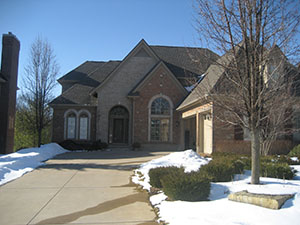

#DGMD-E-27-Spring2016-P4

This is the fourth assignment for DGMD E-27.

#Source Code

The code consists of the following files:

##Source HTML/php:
**index.php** - This is the landing page for the site. The header image is now contained in a div and uses interchange to swap for the various screen sizes. There is a main section that has some text describing the site and neighborhood as well as some responsive images that also use interchange. There is also a sidebar that incorporates a weather widget using the openweather API.

**photogallery.php** - This is a page for showing various neighborhood photo albums which could be accessed by clicking on the image. Only the pond image links to a gallery (thepondgallery.php. There is no weather sidebar on this page.

**thepondgallery.php** - This is a gallery page containing various photos of the neighborhood pond. This file incorporates the Orbit JavaScript based widget.

**thenaturepreserve.php** - This is another gallery page containing various photos of the nature preserve. This file incorporates the flexbox container/child code as well as some SVG/CSS animation.

**thingstodo.php** - This is a page for showing pictures of things to do in the city where my neighborhood resides. This page also shows the column swapping when going from desktop to mobile portrait mode as described in the week 3 videos. This page also uses more media queries around the end points for the typical media queries to maximize the image sizes for the appropriate screen widths.

**contact.php/login.php/register.php** - These are all form based php files with the weather widget side bar on the right side.

##SASS Source Files:
**app.scss** - This is the default foundation sass file that links in all the other partial sass files..<br>

##SASS Partial Files:
###Forms
**_formstyle.scss** - Stylings for the various forms in the site.<br>
**_form_variables.scss** - Sass variables used in formstyle partial.<br>
**_form_extends.scss** - Extends used in the formstyle partial.<br>
**_form_mixins.scss** - Mixins used in the formstyle partial.<br>
###Thingstodo
**_thingstodo.scss** - Stylings for the thingstodo page.<br>
**_thingstodo_variables.scss** - Sass variables used in the thingstodo partial.<br>
**_thingstodo_mixins.scss** - Mixins used in the thingstodo partial.<br>
###Weather
**_weather-style.scss** - Stylings for the weather sidebar.<br>
**_weather_variables.scss** - Variables used in the weather sidebar partial.<br>
**_weather_mixins.scss** - Mixins used in the weather sidebar partial.<br>
###Nature Preserve
**_naturepreserve.scss** - Stylings specific to the nature preserve gallery.<br>
###General
**_helper_functions.scss** Some helper functions for other mixin files.<br>
**_styles.scss** - General stylings for site pages.<br>
**_variables.scss** - Variables for site pages.<br>
**_mixins.scss** - Mixins for the site pages.<br>
**_overrides.scss** - Foundation overrides in a specific file in order to find easier.<br>
**_settings.scss** - This is the default settings sass file that has some project specific modifications.<br>

## Generated CSS Files:
As everything is incorporated as partials, there is only one generated css file with regards to the work that I am doing.
**app.css** - This stylesheet contains all the styles from the foundation files as well as my own specific stylings.<br>

##JS Source Files (not including associated js needed for foundation):
**openWeather.js** - jQuery code snippet from Michael Lynch (http://michaelynch.com) distributed under MIT license to access the OpenWeather API.<br>

# Assignment Specific Topics
## Browser/Operating System
I primarily used a Google Chrome browser (Version 48.0.2564.116 m) running on a Windows 10 (64 bit) machine and Safari running on an Apple iPhone 6s plus (iOS 9.2.1).
## Build a Website with Foundation
I am using the responsive website I built from Assignment 1, added SASS to in Assignment 2, and then added Foundation to in Assignment 3 as a starting point for this assignment.<br>
The URL for Assignment 1 is: http://dgmd-e27-p1.mikevartanian.me/index.php<br>
The URL for Assignment 2 is: http://dgmd-e27-p2.mikevartanian.me/index.php<br>
The URL for Assignment 3 is: http://dgmd-e27-p3.mikevartanian.me/index.php<br>
The comments and code for Assignment 1 are located in GitHub here: https://github.com/mvartani76/DGMD-E-27-Spring2016-P1<br>
The comments and code for Assignment 2 are located in GitHub here: https://github.com/mvartani76/DGMD-E-27-Spring2016-P2<br>
The comments and code for Assignment 3 are located in GitHub here: https://github.com/mvartani76/DGMD-E-27-Spring2016-P3<br>

## Grid

The site incorporates a responsive grid system using the foundation framework.<br>
The site utilizes the **Source Ordering** feature in **thingstodo.php** to move the order of the columns around between the small (mobile portrait) and large (desktop) screen widths.<br>
In all screen widths besides small (mobile portrait), the aside showing the township information is the leftmost column, the main section is in the middle, and the weather bar is on the right. In the small (mobile portrait) screen width, the main section is effectively the leftmost column as it is shown on top while the township information is on the right since it is below. The weather bar is hidden for small screen widths so is not shown.<br>

The code snippet starting at **line 50** of **thingstodo.php** shown below shows how the main section is setup.
```HTML
<!-- Added the xxx-push-3 class which moves this column right 25% to make this display (xxx-6)
display in the middle for screen sizes >479px.
For screen sizes <=479px, they will display in normal order as written. -->
<main class="xlarge-6 large-6 medium-6 xlarge-push-3 large-push-3 medium-push-3 columns" data-equalizer-watch>
	<h2>Things to Do in Commerce Township</h2>
	...
</main>
```
The main section is six (6) columns wide and is pushed right three (3) columns for all screen widths except small.<br>

The code snippet starting at **line 148** of **thingstodo.php** shown below shows how the weather bar is setup.
```HTML
<!-- Added the xxx-push-3 class which moves this column right 25% to make this display (xxx-3)
display in the right for screen sizes >479px
For screen sizes <=479px, they will display in normal order as written. -->
<div class="xlarge-3 large-3 medium-3 xlarge-push-3 large-push-3 medium-push-3 columns outside-w-wrapper hide-for-small-only" data-equalizer-watch>
	<h3>Local Time &amp; Weather</h3>
	...
</div>
```
The weather bar is three (3) columns wide and is pushed right three (3) columns for all screen widths except small.<br>

The code snippet starting at **line 201** of **thingstodo.php** shown below shows how the `<aside>` is setup.
```HTML
<!-- Added the col-pull-9 class which moves this column left 75% to make this display (xxx-3)
display in the left for screen sizes >479px
For screen sizes <=479px, they will display in normal order as written. -->
<aside class="xlarge-3 large-3 medium-3 xlarge-pull-9 large-pull-9 medium-pull-9 columns" data-equalizer-watch>
	<h3>Commerce Township Info</h3>
	<ul>
		<li><a href="https://en.wikipedia.org/wiki/Commerce_Township,_Michigan" target="_blank">Population:</a> 40,186</li>
		<li><a href="https://en.wikipedia.org/wiki/Commerce_Township,_Michigan" target="_blank">Total Area:</a> 29.8 square miles</li>
		<li><a href="http://www.distance-cities.com/distance-detroit-mi-to-commerce-township-mi" target="_blank">Miles northwest from Detroit:</a> 28</li>
		<li><a href="https://en.wikipedia.org/wiki/Commerce_Township,_Michigan" target="_blank">Number of Households:</a> 12,379</li>
		<li><a href="https://en.wikipedia.org/wiki/Commerce_Township,_Michigan" target="_blank">Number of Families:</a> 9,754</li>
		<li><a href="https://en.wikipedia.org/wiki/Commerce_Township,_Michigan" target="_blank">Median Household Income:</a> $72,702</li>
		<li><a href="https://en.wikipedia.org/wiki/Commerce_Township,_Michigan" target="_blank">Median Family Income:</a> $79,976</li>
		<li><a href="https://en.wikipedia.org/wiki/Commerce_Township,_Michigan" target="_blank">Median Age:</a> 36 years</li>
		<li><a href="https://en.wikipedia.org/wiki/Commerce_Township,_Michigan" target="_blank">Number of School Districts:</a> 2</li>
	</ul>
</aside>
```
The `<aside>` is three (3) columns wide and is pulled left nine (9) columns for all screen widths except small. This effectively puts it as the leftmost column for all screen widths except small.<br>

## Navigation

The site has a navigation bar below the header image of each page. The navigation bar is responsive and toggles (uses a hamburger button) for the small screen size. The navigation bar is also expanded, incorporates top-bar and the dropdown features. The code below shows the navigation bar for **index.php** (starting at **line 28** in **index.php**).

```HTML
<div class="title-bar" data-responsive-toggle="nav-menu" data-hide-for="medium">
  <button class="menu-icon" type="button" data-toggle></button>
    <div class="title-bar-title">Menu</div>
</div>

<div class="row">
  <div class="top-bar" id="nav-menu">
    <ul class="menu dropdown expanded" data-dropdown-menu>
      <li class="active"><a href="./index.php">Home</a></li>
      <li><a href="#">About</a></li>
      <li><a href="./thingstodo.php">Things to Do</a></li>
      <li><a href="./photogallery.php">Photo Gallery</a></li>
      <!-- Login/Register is a dropdown menu and contains submenus for Login and Register -->
      <li class=".is-dropdown-submenu-parent"><a href="#">Login/Register</a>
        <ul class="menu">
          <li><a href="./login.php">Login</a></li>
          <li><a href="./register.php">Register</a></li>
        </ul>
      </li>
      <li><a href="./contact.php">Contact Us</a></li>
    </ul>
  </div>
</div>
```
## Styling
The site incorporates many of the different foundation style elements in the site.
### Button
The form pages all incorporate a button for submission of the form.<br>
An example of an expanded button using a custom color from **login.php** is shown below.
```HTML
<fieldset>
	<!-- Use a callout to indicate to user that there are errors in the form -->
	<div data-abide-error class="alert callout" style="display: none;">
		<p class="callout.alert"><i class="fi-alert"></i> There are some errors in your form.</p>
	</div>

	<!-- Using Foundation Button class with customized color that I added to the color pallette -->
	<button name="submit" type="submit" class="button my-secondary-background expanded" id="login_id-submit" data-submit="...Sending">Submit</button>
</fieldset>
```
The button is declared on **line 81** of **login.php**.  Similar examples of the button are located in **register.php** and **contact.php**.
### Callout
The form pages also all incorporate a callout to indicate to the user that if there are errors in the form. An example of a callout using a custom color from **register.php** is shown below.
```HTML
<fieldset>
	<div data-abide-error class="alert callout" style="display: none;">
		<p class="callout.alert"><i class="fi-alert"></i> There are some errors in your form.</p>
	</div>				    
	<button name="submit" type="submit" class="button my-secondary-background expanded" id="register-submit" data-submit="...Sending">Submit</button>
</fieldset>
```
We see the callout implemented in the parent div and paragraph. The parent div callout is from **line 76** of **register.php**. Similar examples of callouts are located in **login.php** and **contact.php**.
### Visibility Classes
The site uses visibility classes primarily to hide the weather bar in the small screen width as shown in the code snippet starting at **line 107** of **contact.php**.
```HTML
<div class="outside-w-wrapper xlarge-3 large-3 medium-3 columns hide-for-small-only" data-equalizer-watch>
	<h3>Local Time &amp; Weather</h3>
	...
</div>
```
## Form

There are three forms pages in the side and they are located in the following files.<br>
**login.php** - This is the login form page.<br>
**register.php** - This is the registration form page.<br>
**contact.php** - This is the contact form page.<br>

All the forms use Javascript Abide form validation tool. The code snippet for the login form is shown below. This starts at 
**line 55** of **login.php**.
```HTML
<form class="login_id" data-abide novalidate method="post">
	<h3>Login</h3>
	<h4>Please enter your username and password to login...</h4>
	<fieldset>
		<input type="text" placeholder="Username" id="login_username" name="username" tabindex="1" required>
		<!-- Throw an error message if username is not entered -->
		<span class="form-error">
			Username is required.
		</span>
	</fieldset>

	<fieldset>
		<input placeholder="Password" id="password" name="userpassword" type="password" tabindex="2" required>
		<!-- Throw and error messiage if password is not entered -->
		<span class="form-error">
		  Password is required.
		</span>
	</fieldset>

	<fieldset>
		<!-- Use a callout to indicate to user that there are errors in the form -->
		<div data-abide-error class="alert callout" style="display: none;">
			<p class="callout.alert"><i class="fi-alert"></i> There are some errors in your form.</p>
		</div>

		<!-- Using Foundation Button class with customized color that I added to the color pallette -->
		<button name="submit" type="submit" class="button my-secondary-background expanded" id="login_id-submit" data-submit="...Sending">Submit</button>
	</fieldset>
</form>
```
## Interchange
Interchange is used for all images throughout the site to make them responsive.<br>
The "header" image uses interchange in each source file to change the source image for the various screen widths. One example of this is shown starting on **line 19** of **index.php**.
```HTML
<div class="row">
	
	<noscript></noscript>
</div>
```
## JavaScript widgets
The following widgets have been implemented in this site.
### Abide
As mentioned earlier, each of the form pages utilize the **Abide** data validation feature. The code snippet for the login form is shown below. This starts at **line 55** of **login.php**.
```HTML
<form class="login_id" data-abide novalidate method="post">
	<h3>Login</h3>
	<h4>Please enter your username and password to login...</h4>
	<fieldset>
		<input type="text" placeholder="Username" id="login_username" name="username" tabindex="1" required>
		<!-- Throw an error message if username is not entered -->
		<span class="form-error">
			Username is required.
		</span>
	</fieldset>

	<fieldset>
		<input placeholder="Password" id="password" name="userpassword" type="password" tabindex="2" required>
		<!-- Throw and error messiage if password is not entered -->
		<span class="form-error">
		  Password is required.
		</span>
	</fieldset>

	<fieldset>
		<!-- Use a callout to indicate to user that there are errors in the form -->
		<div data-abide-error class="alert callout" style="display: none;">
			<p class="callout.alert"><i class="fi-alert"></i> There are some errors in your form.</p>
		</div>

		<!-- Using Foundation Button class with customized color that I added to the color pallette -->
		<button name="submit" type="submit" class="button my-secondary-background expanded" id="login_id-submit" data-submit="...Sending">Submit</button>
	</fieldset>
</form>
```

### Orbit
The Orbit gallery Javascript widget is implemented starting on **line 56** of **thepondgallery.php** as shown in the code snippet below.
```HTML
<div class="orbit pondgallery" role="region" aria-label="Favorite Space Pictures" data-orbit>
	<ul class="orbit-container">
		<button class="orbit-previous"><span class="show-for-sr">Previous Slide</span>&#9664;&#xFE0E;</button>
		<button class="orbit-next"><span class="show-for-sr">Next Slide</span>&#9654;&#xFE0E;</button>
		<li class="is-active orbit-slide">
			
			<figcaption class="orbit-caption">The pond is just on the other side of the street...</figcaption>
		</li>
		<li class="orbit-slide">
			
			<figcaption class="orbit-caption">A closer look at the well...</figcaption>
		</li>
		<li class="orbit-slide">
			
			<figcaption class="orbit-caption">A view of the pond with the well from the street...</figcaption>
		</li>
		<li class="orbit-slide">
			
			<figcaption class="orbit-caption">Many kids use the pond to ice skate on in the winter...</figcaption>
		</li>
		<li class="orbit-slide">
			
			<figcaption class="orbit-caption">The well is non-functional...</figcaption>
		</li>
		<li class="orbit-slide">
			
			<figcaption class="orbit-caption">Another view of the pond...</figcaption>
		</li>
		<li class="orbit-slide">
			
			<figcaption class="orbit-caption">And here is the pond again...</figcaption>
		</li>
	</ul>
	<nav class="orbit-bullets">
		<button class="is-active" data-slide="0"><span class="show-for-sr">The pond is just on the other side of the street...</span><span class="show-for-sr">Current Slide</span></button>
		<button data-slide="1"><span class="show-for-sr">A view of the pond with the well from the street...</span></button>
		<button data-slide="2"><span class="show-for-sr">Third slide details.</span></button>
		<button data-slide="3"><span class="show-for-sr">Many kids use the pond to ice skate on in the winter...</span></button>
		<button data-slide="4"><span class="show-for-sr">The well is non-functional...</span></button>
		<button data-slide="5"><span class="show-for-sr">Another view of the pond...</span></button>
		<button data-slide="6"><span class="show-for-sr">And here is the pond again...</span></button>
	</nav>
</div>
```
Please note that I customized the styling of the orbit buttons as shown starting on **line 420** of **_settings.scss** in the code snippet below.
```SCSS
// 25. Orbit
// ---------

//$orbit-bullet-background: $medium-gray;
$orbit-bullet-background: $secondary-background-color;
//$orbit-bullet-background-active: $dark-gray;
$orbit-bullet-background-active: $menu-toggle-hover-active-color;
$orbit-bullet-diameter: 1.2rem;
$orbit-bullet-margin: 0.1rem;
$orbit-bullet-margin-top: 0.8rem;
$orbit-bullet-margin-bottom: 0.8rem;
$orbit-caption-background: rgba($black, 0.5);
$orbit-caption-padding: 1rem;
$orbit-control-background-hover: rgba($black, 0.5);
$orbit-control-padding: 1rem;
$orbit-control-zindex: 10;
```
Here you can see that I changed `$orbit-bullet-background` and `$orbit-bullet-background-active` to colors that matched my site. I also commented out the previous values as we were told to do in the videos.

### Equalizer
The Equalizer JavaScript widget is used throughout the site to make the column heights the same. Initially I had just used it for the photos and corresponding paragraph text in **photogallery.php** but I expanded the usage to all other pages too give the site a cleaner look so the column color extended all the way to the bottom (for example in any of the form pages such as **register.php**). The Equalizer code snippet starts on **line 55** of **photogallery.php** and is shown below.
```HTML
<div class="row" data-equalizer>
	<div class="col-1-2-4 large-3 medium-6 columns" data-equalizer-watch>
		<h3>The Nature Preserve</h3>
		<a href="#"></a>
		<p>We are so lucky to have a state nature preserve with a forest, lake and a river with lots of natural wildlife.</p>
	</div>
	<div class="col-1-2-4 large-3 medium-6 columns" data-equalizer-watch>
		<h3>The Front Pond</h3>
		<a href="./thepondgallery.php"></a>
		<p>The pond near our subdivision entrance way is both beautiful as well as a source for winter enjoyment.</p>
	</div>
	<div class="col-1-2-4 large-3 medium-6 columns" data-equalizer-watch>
		<h3>Night Time</h3>
		<a href="#"></a>
		<p>The beauty of our neighborhood at night during the holidays...</p>
	</div>
	<div class="col-1-2-4 large-3 medium-6 columns" data-equalizer-watch>
		<h3>Our Houses</h3>
		<a href="#"></a>
		<p>We have many beautiful houses in our neighborhood. Please see pictures of the houses that our residents have shared.</p>
	</div>
</div>
```
### Dropdown/Accordion
As mentioned in the Navigation section above, the site incorporates the dropdown/accordion elements in the navigation bar. The following code snippet shows the dropdown/accordion elements integrated into the navigation menu. Although the navigation menu is present on every page, the code shown below starts on **line 33** of **photogallery.php**.
```HTML
<div class="top-bar" id="nav-menu">
	<ul class=" medium-horizontal vertical dropdown menu" data-responsive-menu="accordion medium-dropdown">
		<li><a href="./index.php">Home</a></li>
		<li><a href="#">About</a></li>
		<li><a href="./thingstodo.php">Things to Do</a></li>
		<li class="active"><a href="./photogallery.php">Photo Gallery</a></li>
		<!-- Login/Register is a dropdown menu and contains submenus for Login and Register -->
		<li class="has-submenu"><a href="#">Login/Register</a>
			<ul class="submenu menu vertical nested" data-submenu>
				<li><a href="./login.php">Login</a></li>
				<li><a href="./register.php">Register</a></li>
			</ul>
		</li>
		<li><a href="./contact.php">Contact Us</a></li>
	</ul>
</div>
```
## SASS For Sites Modifications
In order to customize the look of the site, there were several changes made to **_settings.scss** and **app.scss** as well as including several other partial files. These other partial files were from the P2 but were source files so I needed to some slight modifications to include them as partials.

### Changes to app.scss
The code snippet below shows the addition of extra custom partial stylesheets. This starts on **line 52** of **app.scss**.
```SCSS
// Custom partial stylesheets
@import 'mixins';
@import 'styles';
@import 'formstyle';
@import 'thingstodo';
@import 'weather-style';
// Include partial for overriding foundation settings
@import 'overrides';
```
### Changes to _settings.scss
#### Include variables partial file
The first change was to include a partial file, **_variables.scss** to the top so all the variable declarations would be recognized in **_settings.scss**. This is shown on **line 44** below.
```SCSS
@import 'variables';
```
#### Update $foundation-palette
The variable/list `$foundation-palette` was updated to include some of my custom colors for the buttons. This is shown starting on **line 52** below.
```SCSS
$foundation-palette: (
  primary: #2199e8,
  secondary: #777,
  success: #3adb76,
  warning: #ffae00,
  alert: #ec5840,
  my-primary-background: $primary-background-color,
  my-secondary-background: $secondary-background-color,
);
```
#### Update Breakpoints
The breakpoints variable/list was updated to include my custom breakpoints. This is shown starting on **line 84** below.
```SCSS
$breakpoints: (
  small: 0,
  medium: $min-phone-landscape-width,
  medium_bk2: $min-phone-width-breakpoint2,
  medium_bk1: $min-phone-width-breakpoint1,
  large: $min-tablet-width,
  large_bk1: $min-tablet-width-breakpoint1,
  xlarge: $min-desktop-width,
  xlarge_bk1: $min-desktop-width-breakpoint1,
  xxlarge: 1440px,
);
$breakpoint-classes: (small medium medium_bk1 medium_bk2 large large_bk1 xlarge xlarge_bk1);
```
#### Change Accordion Menu Arrow Color
The accordion menu arrow color was updated to match the style of the site as shown starting on **line 213** below.
```SCSS
// 8. Accordion Menu
// -----------------

$accordionmenu-arrows: true;
//$accordionmenu-arrow-color: $primary-color;
$accordionmenu-arrow-color: $menu-toggle-hover-active-color;
```
#### Update Dropdown Menu Stylings
The dropdown menu arrow color and border was updated to match the site style as shown starting on **line 314** below.
```SCSS
// 17. Dropdown Menu
// -----------------

$dropdownmenu-arrows: true;
//$dropdownmenu-arrow-color: $anchor-color;
$dropdownmenu-arrow-color: $menu-toggle-hover-active-color;
$dropdownmenu-min-width: 200px;
$dropdownmenu-background: $white;
//$dropdownmenu-border: 1px solid $medium-gray;
$dropdownmenu-border: 1px solid $menu-toggle-hover-active-color;
```
#### Update Orbit Styles
The Orbit bullet styles were updated to match the site style as shown starting on **line 420** below.
```SCSS
// 25. Orbit
// ---------

//$orbit-bullet-background: $medium-gray;
$orbit-bullet-background: $secondary-background-color;
//$orbit-bullet-background-active: $dark-gray;
$orbit-bullet-background-active: $menu-toggle-hover-active-color;
$orbit-bullet-diameter: 1.2rem;
$orbit-bullet-margin: 0.1rem;
$orbit-bullet-margin-top: 0.8rem;
$orbit-bullet-margin-bottom: 0.8rem;
$orbit-caption-background: rgba($black, 0.5);
$orbit-caption-padding: 1rem;
$orbit-control-background-hover: rgba($black, 0.5);
$orbit-control-padding: 1rem;
$orbit-control-zindex: 10;
```
#### Update Title Bar Styles
The Title Bar Background and Hover colors were modified to match the site styles as shown starting on **line 547** below.
```SCSS
// 34. Title Bar
// -------------

//$titlebar-background: $black;
$titlebar-background: $secondary-background-color;
$titlebar-color: $white;
$titlebar-padding: 0.5rem;
$titlebar-text-font-weight: bold;
$titlebar-icon-color: $white;
//$titlebar-icon-color-hover: $medium-gray;
$titlebar-icon-color-hover: $menu-toggle-hover-active-color;
$titlebar-icon-spacing: 0.25rem;
```
#### Update Top Bar Styles
The topbar background was modified to match the site style as shown starting on **line 573** below.
```SCSS
// 36. Top Bar
// -----------

$topbar-padding: 0.5rem;
//$topbar-background: $light-gray;
$topbar-background: $secondary-background-color;
$topbar-submenu-background: $topbar-background;
$topbar-title-spacing: 1rem;
$topbar-input-width: 200px;
$topbar-unstack-breakpoint: medium;
```
## SASS For Email Modifications
In order to get the email styles to match the site look, I needed to make some modifications to the SASS files.
### Changes in _settings.scss
#### Added Color Variables
Added color variables which are used later... The code snippet showing these delcartions starting on **line 30** is shown below.
```SCSS
$sog-primary-color: #ED8F00;
$sog-secondary-color: #a16100;
```
#### Callout Modifications
Updated the callout border as shown in the code snippet starting on **line 131** below.
```SCSS
$callout-border-sog-primary: 1px solid darken($sog-primary-color, 20%);
```
#### Overrides
I included pre-defined variables in this file to override the previously set variables in the source SASS files... The code snippet starts on **line 150** and is shown below.
```SCSS
// 9. Mike's Overrides
// -------------------
$container-background: #EFECCA;
$header-color: #61381D;
$global-font-color: #BB6F39;
$hr-border: 1px solid $sog-secondary-color;

@import url(http://fonts.googleapis.com/css?family=Lato:400,700);
@import url(https://fonts.googleapis.com/css?family=Francois+One);
$google-font: Lato;
$google-font2: 'Francois One';
$body-font-family: $google-font;
$header-font-family: $google-font2;
```
### Other style updates
In addition to the variables in **_settings.scss**, I needed to update a few of the source partials.
#### _button.scss
Added code for another color ($sog-secondary-color) button. This is shown starting on **line 283** below.
```SCSS
// MCV Edit for SOG Color Button
table.button.sog-secondary {
  table {
    td {
      background: $sog-secondary-color;
      border: 2px solid $sog-secondary-color;
    }

    a {
      border: 0px solid $sog-secondary-color;
    }
  }
}

table.button.sog-secondary:hover {
  table {
    td {
      background: darken($sog-secondary-color, 10%);
    }

    a {
      border: 0px solid darken($sog-secondary-color, 10%);
    }
  }
}
```
#### _callout.scss
Added variable for and associated code to create a custom styled callout. The variable is declared on **line 17** as shown below.
```SCSS
$callout-background-fade-sog-primary: 10%;
```
And the additional code to set the sog-primary callout starts on **line 88** as shown below.
```SCSS
  &.sog-primary {
    background: scale-color($sog-primary-color, $lightness: $callout-background-fade-sog-primary);
    border: $callout-border-sog-primary;
    color: $sog-secondary-color;
  }
```
